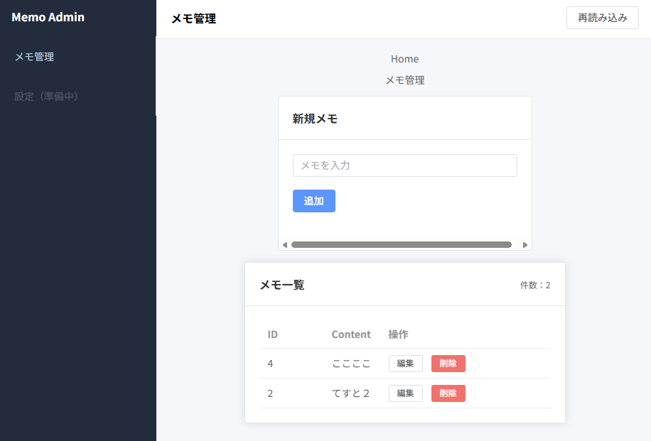

# Vue Memo (Flask + Vue)

Flask（SQLite）で作成したREST APIを、Vue（Vite）から利用するメモアプリです。  




バックエンドとフロントエンドを分離した構成になっています。

---

## 📁 プロジェクト構成
```bash
flask-memo/
├─ backend/ # Flask API + SQLite
│ ├─ app.py
│ ├─ requirements.txt
│ ├─ memo.db # 自動生成（Git管理外）
│ └─ venv/ # 仮想環境（Git管理外）
└─ frontend/ # Vue (Vite)
  ├─ package.json
  ├─ index.html
  └─ src/
```


---

## 🛠 必要環境

- Python 3.x
- Node.js (npm)

---

# 🚀 起動手順

## ① Backend（Flask API）

```powershell
cd backend

# 仮想環境作成（初回のみ）
python -m venv venv

# 仮想環境有効化
venv\Scripts\Activate.ps1

# 依存インストール（初回のみ）
pip install -r requirements.txt

# サーバー起動
python app.py
```

起動後アクセス確認：  
```bash
http://127.0.0.1:5000/api/memos
```

## ② Frontend（Vue）
別ターミナルで：
```powershwell
cd frontend

npm install
npm run dev
```

起動後：
```bash
http://localhost:5173
```

# 📡 API仕様
Base URL:
```bash
http://127.0.0.1:5000
```

| Method | Endpoint          | 内容     |
| ------ | ----------------- | ------ |
| GET    | `/api/memos`      | メモ一覧取得 |
| POST   | `/api/memos`      | メモ作成   |
| PUT    | `/api/memos/<id>` | メモ更新   |
| DELETE | `/api/memos/<id>` | メモ削除   |

## POST / PUT リクエスト例
```json
{
  "content": "hello"
}
```

# 💾 データベース
- SQLiteを使用
- backend/memo.db は自動生成
- Git管理対象外
- スキーマ定義: `backend/schema.sql`
- 実DBファイル: `backend/memo.db`（Git管理外）

```powershell
cd backend
del memo.db
python app.py
```

# 🔐 CORS
Vue（別ポート）からAPIへアクセスするため、
Flask側でCORSを有効化しています。

# 🧠 学習ポイント
- RESTful API設計
- CRUD操作（Create / Read / Update / Delete）
- FlaskとSQLiteの連携
- Vueからのfetch通信
- フロントエンド / バックエンド分離構成

# ✨ 今後の改善候補
- エラーハンドリング強化
- APIレスポンス統一フォーマット
- 認証機能追加
- ディレクトリ構成の整理（Blueprint化など）

